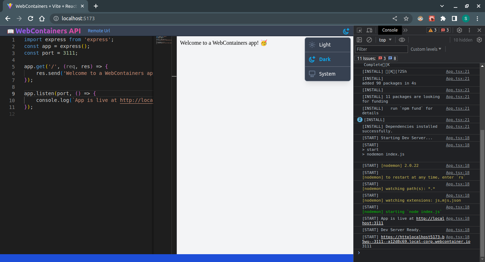

# WebContainers API usage sample

## Technologies Used
- [Vite](https://vitejs.dev)
- [React](https://react.dev "react.dev")
- [@headlessui/react](https://headlessui.com)
- [Tailwind CSS](https://tailwindcss.com)
- [WebContainers API](https://webcontainers.io)
- [Monaco Editor](https://microsoft.github.io/monaco-editor)
- [@monaco-editor/react](https://www.npmjs.com/package/@monaco-editor/react)
- [vs-splitview-react](https://www.npmjs.com/package/vs-splitview-react)
- Dark theme
